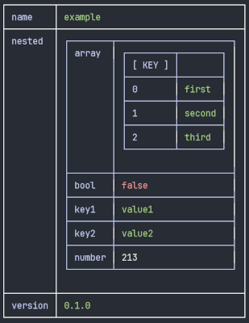

# jt - JSON/YAML/XML to Table

A command-line tool to render JSON, YAML or XML data as tables.

```json
{
  "name": "example",
  "version": "0.1.0",
  "nested": {
    "key1": "value1",
    "key2": "value2",
    "number": 213,
    "bool": false,
    "array": ["first", "second", "third"]
  }
}
```



## Installation

```bash
go build .
./jt
```

## Usage

`jt` can read from a file or from stdin.

### From file

```bash
./jt <file> [selector]
```

### From stdin

```bash
cat <file> | ./jt [selector]
```

### Selector

The selector is optional. If provided, it allows you to select a top-level key from the data.

- `.` (default): Renders the entire object.
- `.key`: Renders the value of the specified key.

## Navigation

When viewing wide tables, you can use the following keys to navigate:

| Key(s)               | Action             |
| -------------------- | ------------------ |
| `↑`, `k`             | Move up            |
| `↓`, `j`             | Move down          |
| `←`, `h`             | Scroll left        |
| `→`, `l`             | Scroll right       |
| `g`, `home`          | Jump to the top    |
| `G`, `end`           | Jump to the bottom |
| `q`, `esc`, `ctrl+c` | Quit               |
